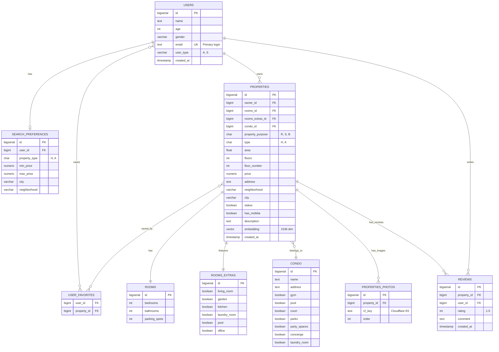

<div align="center">

# HomeMatch

**AI-powered real estate search platform**

[](https://github.com/)
[](https://github.com/)
[](LICENSE)

</div>

HomeMatch goes beyond traditional real estate portals. While platforms like Zap Imóveis and OLX rely entirely on manually entered data, HomeMatch uses a vision LLM to **automatically analyze property photos** and extract objective visual characteristics — lighting, architectural style, furniture quality, atmosphere — enriching search results with data that no human had to input.

The result is a search engine that understands both objective filters ("2 bedrooms, up to R$2,000") and subjective intentions ("I want something cozy with plenty of natural light").

---

## Table of Contents

- [Overview](#overview)
- [Features](#features)
- [Business Innovations](#business-innovations)
- [Architecture](#architecture)
- [Tech Stack](#tech-stack)
- [Database](#database)
- [API Endpoints](#api-endpoints)
- [Getting Started](#getting-started)
- [Project Structure](#project-structure)
- [Team](#team)

---

## Overview

### The Problem

Existing real estate portals have a fundamental flaw: **search quality depends entirely on listing quality**. If the advertiser didn't tag "well-lit" or "modern style", users will never find that property by searching for those criteria.

### The Solution

HomeMatch solves this in two layers:

**Layer 1 — Automatic visual enrichment:** when a property is listed, its photos are sent to a vision LLM that generates a structured report with dozens of visual attributes. This report is stored and used to power search.

**Layer 2 — Intent-based search:** users can describe what they want in natural language ("I want something that feels like home, with warm light and big windows") and the system maps that intent to objective attributes extracted by the AI.

---

## Features

### Sprint 1 — Foundation (Completed)
- [x] JWT authentication (register, login, logout, token refresh)
- [x] User profile with search preferences
- [x] Full property CRUD with objective filters
- [x] Photo upload linked to properties (Cloudflare R2)
- [x] Review system with rating and comment
- [x] User favorites
- [x] Search with filters by price, area, rooms, city, condo and more

### Sprint 2 — AI Core (Planned)
- [ ] Photo analysis with LLM Vision
- [ ] Automatic property categorization
- [ ] Total cost-of-living analysis (taxes, utilities, neighborhood)
- [ ] Surroundings analysis (safety, nearby services via Google Places)
- [ ] Visual filters based on AI-extracted attributes

### Sprint 3 — Innovation (Planned)
- [ ] Conversational search assistant
- [ ] Behavior-based personalized recommendations
- [ ] Real estate partner integrations
- [ ] New property alerts by user profile
- [ ] Full React frontend

---

## Business Innovations

### 1. Automated Visual Analysis via AI
The core technical innovation. Instead of relying on manually entered tags, the platform processes each photo with a vision LLM and extracts attributes such as:

- Brightness and color temperature
- Architectural style (modern, classic, industrial, etc.)
- State of conservation
- Furniture quality and style
- Overall atmosphere
- Perceived ventilation, depth, and visual harmony

These attributes are stored as embeddings and used for semantic search.

### 2. Intent-Based Search Assistant
Users describe what they want in natural language. The system interprets the intent and maps it to objective attributes in the database:

> *"I want something that feels like home, with warm light and large windows"*
> → filters by `brightness: high`, `color_temp: warm`, `windows: large`

This solves a real UX problem: **most people don't know which filters to use**, but they know how they want to feel in a space.

---

## Architecture

```
HomeMatch/
├── Backend (Django REST Framework)
│   ├── apps/users/          → Auth, profile, preferences, favorites
│   ├── apps/properties/     → Properties, photos, reviews, filters
│   ├── apps/search/         → Search engine and advanced filters
│   └── apps/ai_analysis/    → LLM Vision integration
├── Database (PostgreSQL + pgvector)
├── Image Storage (Cloudflare R2)
└── Frontend (React — Sprint 3)
```

**Property listing flow with AI:**
```
Advertiser creates listing
    → Photos uploaded to Cloudflare R2
    → Celery sends photos to LLM Vision (async)
    → LLM returns structured report
    → Report saved as embedding in PostgreSQL
    → Property available for enriched search
```

---

## Tech Stack

| Layer | Technology |
|-------|-----------|
| **Backend** | Python 3.12 + Django 5.2 |
| **API** | Django REST Framework |
| **Authentication** | JWT via `djangorestframework-simplejwt` |
| **Database** | PostgreSQL 16 + pgvector |
| **Storage** | Cloudflare R2 (S3-compatible) |
| **AI** | LLM Vision API (GPT-4V / Gemini — TBD) |
| **Containerization** | Docker + Docker Compose |
| **CI/CD** | GitHub Actions |
| **Code Quality** | black, flake8, pylint, bandit |
| **Frontend** | React (Sprint 3) |

---

## Database



---

## API Endpoints

### Authentication
| Method | Endpoint | Access | Description |
|--------|----------|--------|-------------|
| `POST` | `/api/users/register/` | Public | Register a new user |
| `POST` | `/api/users/login/` | Public | Login — returns `access` and `refresh` tokens |
| `POST` | `/api/users/token/refresh/` | Public | Renew `access` token |
| `POST` | `/api/users/logout/` | Authenticated | Blacklist `refresh` token |

### User
| Method | Endpoint | Access | Description |
|--------|----------|--------|-------------|
| `GET` | `/api/users/me/` | Authenticated | Logged-in user data |
| `PATCH` | `/api/users/me/` | Authenticated | Update profile and preferences |
| `GET` | `/api/users/favorites/` | Authenticated | List favorite properties |
| `POST` | `/api/users/favorites/` | Authenticated | Add property to favorites |
| `DELETE` | `/api/users/favorites/` | Authenticated | Remove property from favorites |

### Properties
| Method | Endpoint | Access | Description |
|--------|----------|--------|-------------|
| `GET` | `/api/properties/` | Public | List properties with filters |
| `POST` | `/api/properties/` | Advertiser | Create new property |
| `GET` | `/api/properties/{id}/` | Public | Property details + average rating |
| `PATCH` | `/api/properties/{id}/` | Owner | Update property |
| `DELETE` | `/api/properties/{id}/` | Owner | Delete property |

### Photos
| Method | Endpoint | Access | Description |
|--------|----------|--------|-------------|
| `POST` | `/api/properties/{id}/photos/` | Owner | Upload photos |
| `DELETE` | `/api/properties/photos/{id}/` | Owner | Delete photo |

### Reviews
| Method | Endpoint | Access | Description |
|--------|----------|--------|-------------|
| `GET` | `/api/properties/{id}/reviews/` | Public | List property reviews |
| `POST` | `/api/properties/{id}/reviews/` | Authenticated | Create review |
| `PATCH` | `/api/properties/{id}/reviews/{review_id}/` | Review owner | Edit review |
| `DELETE` | `/api/properties/{id}/reviews/{review_id}/` | Review owner | Delete review |

### Available filters for `GET /api/properties/`
```
?min_price=1000&max_price=5000
?min_area=50&max_area=150
?city=Natal&neighborhood=Ponta+Negra
?bedrooms=2&bathrooms=1
?parking_spots=1
?type=A                  (A=Apartment, H=House)
?property_purpose=R      (R=Rent, S=Sale, B=Both)
?has_mobilia=true
?condo_gym=true&condo_pool=true
?living_room=true&garden=true
```

---

## Getting Started

### Prerequisites
- Docker and Docker Compose
- Git

### 1. Clone the repository
```bash
git clone https://github.com/DevlTz/HomeMatch.git
cd HomeMatch
```

### 2. Configure environment variables
```bash
cp .env.example .env
```

Edit `.env` with your settings:
```env
DEBUG=True
SECRET_KEY=your-secret-key-here

# Database
DB_NAME=homematch_db
DB_USER=admin
DB_PASSWORD=your-password
DB_HOST=db
DB_PORT=5432

# Cloudflare R2 (image storage)
R2_ACCESS_KEY_ID=your-key
R2_SECRET_ACCESS_KEY=your-secret
R2_BUCKET_NAME=your-bucket
R2_ACCOUNT_ID=your-account-id
```

### 3. Start the environment
```bash
docker-compose up --build -d
```

### 4. Run migrations
```bash
docker exec -it homematch_web_1 python manage.py migrate
```

### 5. (Optional) Create a superuser
```bash
docker exec -it homematch_web_1 python manage.py createsuperuser
```

### 6. Access
- **API:** http://localhost:8000
- **Django Admin:** http://localhost:8000/admin

---

## Code Quality

The project uses a CI/CD pipeline via GitHub Actions that runs automatically on every push and PR to `main` and `develop`.

### GitHub Actions
- **black** — code formatting
- **flake8** — PEP8 linting
- **pylint** — static analysis
- **bandit** — security analysis
- **coverage** — test coverage

### Local script
Run the full analysis on your machine before opening a PR:
```bash
pip install -r tools/requirements-dev.txt
./tools/run_reports.sh --sprint 1
```

---

## Project Structure

```
HomeMatch/
├── apps/
│   ├── users/              # Auth, profile, preferences, favorites
│   │   ├── models.py       # User, SearchPreference
│   │   ├── serializers.py  # UserSerializer, RegisterSerializer
│   │   ├── views.py        # RegisterUserView, UserViewSet
│   │   └── urls.py
│   ├── properties/         # Properties, photos, reviews
│   │   ├── models.py       # Properties, Rooms, Condo, Reviews, Photos
│   │   ├── permissions.py  # IsAdvertiser, IsPropertyOwner, IsReviewOwner
│   │   ├── filters.py      # PropertiesFilters
│   │   ├── validators.py   # Reusable validators
│   │   ├── services.py     # Cloudflare R2 (upload/delete/url)
│   │   ├── serializers/
│   │   │   ├── property_serializers.py
│   │   │   ├── photo_serializers.py
│   │   │   └── reviews_serializers.py
│   │   └── views/
│   │       ├── property_views.py
│   │       └── photo_views.py
│   ├── search/             # Search engine (Sprint 2)
│   └── ai_analysis/        # LLM integration (Sprint 2)
├── config/
│   ├── settings.py
│   ├── urls.py
│   ├── wsgi.py
│   └── asgi.py
├── docs/
│   ├── jwt.md
│   └── diagrama_database.mermaid
├── tools/
│   ├── run_reports.sh
│   └── requirements-dev.txt
├── Dockerfile
├── docker-compose.yaml
├── requirements.txt
└── .env.example
```

---

## Team

| Name | GitHub |
|------|--------|
| Kauã do Vale Ferreira | [@DevlTz](https://github.com/DevlTz) |
| Luisa Ferreira de Souza Santos | [@luisaferreirass](https://github.com/luisaferreirass) |
| Lucas Graziano dos Santos Anselmo| [@lucasanselmocc](https://github.com/lucasanselmocc) |

---

*Software Engineering course project — UFRN*
